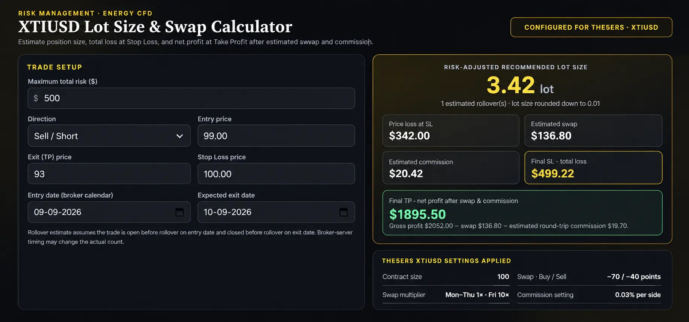

# XTIUSD Lot Size & Swap Calculator

  

A browser-based lot size calculator configured for **The5ers XTIUSD**. It estimates position size from your maximum total risk and Stop Loss, includes estimated swap and commission, and calculates net profit at Take Profit.

  <a href="https://MarketForgeX.github.io/XTIUSD-Lot-Size-Calculator/" target="_blank" rel="noopener noreferrer">🚀 <strong>OPEN LIVE CALCULATOR ↗</strong></a>

## Features

- **Risk-adjusted lot size:** sizes the position using price loss at Stop Loss, estimated swap, and estimated Stop Loss-side commission.
- **Buy / Sell support:** select Buy / Long or Sell / Short.
- **Stop Loss and Take Profit:** enter entry, SL, and TP prices to see estimated total loss at SL and net profit at TP.
- **Swap estimate by holding dates:** enter entry and expected exit dates to estimate weekday rollovers.
- **Friday swap multiplier:** applies the configured 10× multiplier on Fridays; Monday–Thursday use 1×. Weekend days are skipped.
- **Automatic lot step:** rounds the calculated volume down to 0.01 lots.
- **Wide desktop layout:** trade inputs and results are shown side by side, with a stacked layout on smaller screens.

## The5ers XTIUSD settings

| Setting | Calculator value |
| --- | ---: |
| Contract size | 100 |
| Price digits | 2 |
| Buy / Long swap | −70 points |
| Sell / Short swap | −40 points |
| Monday–Thursday swap multiplier | 1× |
| Friday swap multiplier | 10× |
| Commission | 0.03% per side |
| Lot step | 0.01 |

These are the values currently configured in the calculator.

## How to use

1. Enter your **Maximum total risk ($)**.
2. Select **Buy / Long** or **Sell / Short**.
3. Enter the **Entry price**, **Exit (TP) price**, and **Stop Loss price**.
4. Choose the **Entry date** and **Expected exit date** using the broker calendar.
5. Review the recommended lot size, price loss at SL, estimated swap, estimated commission, final total loss at SL, and final net profit at TP.

## Calculation overview

- **Price loss at SL:** absolute distance between entry and SL × contract size × lots.
- **Estimated swap:** configured swap points × point value per lot × applicable rollover multiplier × lots.
- **Final SL loss:** price loss + estimated swap + estimated entry/SL commission.
- **Final TP net profit:** gross TP profit − estimated swap − estimated round-trip commission.
- **Lot size:** calculated from the maximum total risk and rounded down to the nearest 0.01 lot. If the calculated size is below the 0.01 minimum, the calculator shows the minimum lot and a warning that it can exceed the risk limit.

## Rollover date logic

The rollover estimate counts weekdays from the entry date (inclusive) up to, but not including, the expected exit date. Saturday and Sunday are skipped, and the Friday 10× multiplier is applied to Friday rollovers.
